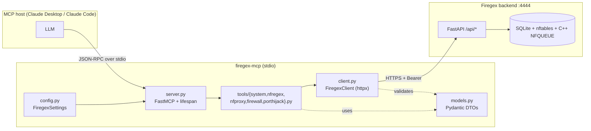
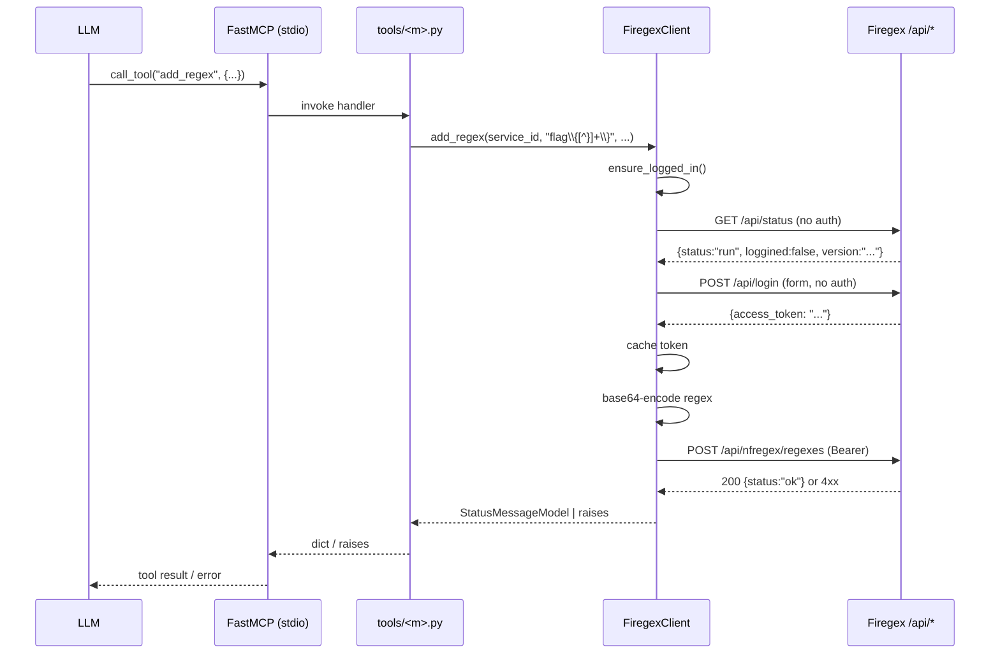
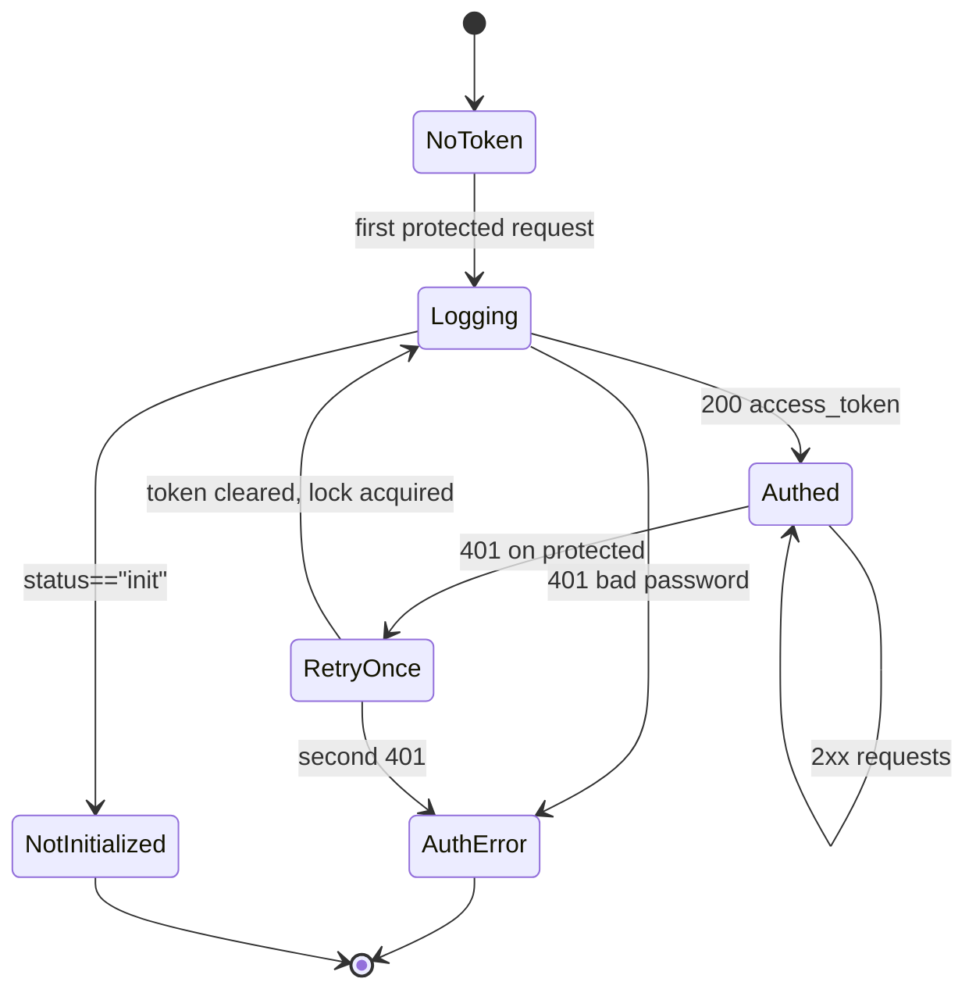

# firegex-mcp — Design Spec

- **Date:** 2026-05-13
- **Status:** Draft (awaiting user approval)
- **Author:** Ismail Galeev
- **Topic:** MCP server exposing the [Firegex](https://github.com/Pwnzer0tt1/firegex) regex-firewall to LLM tooling (Claude Desktop, Claude Code).

## 1. Context

Firegex is a CTF Attack-Defense firewall by Pwnzer0tt1, written as FastAPI + C++ (PCRE2 / NFQUEUE / nftables). It exposes a JWT-protected REST API at `:4444/api/*` covering four functional modules:

| Module | Purpose |
|---|---|
| `nfregex` | Kernel-side PCRE2 regex filtering of TCP/UDP traffic |
| `nfproxy` | Python-pluggable inline proxy (HTTP / raw TCP) |
| `firewall` | UFW-style nftables rules (in/out/forward) |
| `porthijack` | Port redirection (public → proxy) |

The outer repository `firegex-mcp/` currently contains only a stub `main.py` and an empty `pyproject.toml`. Goal: implement an MCP server that wraps Firegex's REST API so an LLM can drive CTF defence end-to-end.

The neighbouring project `../packmate-mcp` (Packmate traffic analyzer) is treated as the canonical reference for layout, idioms, and CI pipeline. This spec deliberately mirrors that template where it does not conflict with Firegex-specific concerns.

## 2. Goals & non-goals

**Goals**

- Full coverage of the four Firegex modules + the system endpoints (`/api/status`, `/api/login`, `/api/set-password`, `/api/change-password`, `/api/interfaces`, `/api/reset`).
- Automatic JWT lifecycle (login on first use, refresh on 401).
- Plain-text regex on the tool boundary; MCP handles base64 in both directions.
- Two ergonomic options for pushing nfproxy Python filters: inline `code: str` and `path: str`.
- Pure async `httpx` client, deterministic and respx-mockable.
- PyPI-ready release pipeline (Trusted Publishing) and a usable Claude Desktop / Claude Code snippet in the README.

**Non-goals**

- Streaming socket.io events (`/sock/...`). MCP is request/response — we do not expose live updates.
- Wrapping the C++ binsrc layer directly. We only talk to the REST API.
- Hosting Firegex itself. We assume the operator runs Firegex independently (`run.py start --prebuilt` or standalone).
- Multi-tenant credential handling. One MCP process serves one Firegex instance.

## 3. Architecture



The package is laid out as:

```
firegex-mcp/
├── pyproject.toml
├── README.md
├── CHANGELOG.md
├── .env.example
├── .github/workflows/{ci.yml,release.yml}
├── docs/superpowers/specs/2026-05-13-firegex-mcp-design.md
├── src/firegex_mcp/
│   ├── __init__.py           # __version__
│   ├── __main__.py           # entry-point `firegex-mcp`
│   ├── config.py             # FiregexSettings
│   ├── client.py             # FiregexClient + exceptions
│   ├── models.py             # Pydantic DTOs + enums
│   ├── server.py             # FastMCP + lifespan, register_all
│   └── tools/
│       ├── __init__.py       # register_all
│       ├── system.py
│       ├── nfregex.py
│       ├── nfproxy.py
│       ├── firewall.py
│       └── porthijack.py
└── tests/
    ├── conftest.py
    ├── test_config.py
    ├── test_client.py
    ├── test_models.py
    └── test_tools.py
```

## 4. Components

### 4.1 `config.py` — `FiregexSettings`

Pydantic-settings model with prefix `FIREGEX_MCP_` and optional `.env` loading.

| Env var | Default | Notes |
|---|---|---|
| `FIREGEX_MCP_BASE_URL` | `http://localhost:4444` | Firegex listener |
| `FIREGEX_MCP_PASSWORD` | — (required) | Used in `/api/login` |
| `FIREGEX_MCP_TIMEOUT_SECONDS` | `30.0` | `>0` |
| `FIREGEX_MCP_VERIFY_SSL` | `true` | For HTTPS deployments |
| `FIREGEX_MCP_LOG_LEVEL` | `INFO` | Literal: `DEBUG`/`INFO`/`WARNING`/`ERROR`/`CRITICAL` |

`extra="ignore"`, `case_sensitive=False`, `env_file=".env"`.

### 4.2 `client.py` — `FiregexClient`

Thin async client over `httpx.AsyncClient`. Three responsibilities: HTTP transport, auth lifecycle, status-to-exception mapping.

**Exception hierarchy:**

```
FiregexError
├── FiregexConnectionError       # timeout / ConnectError / generic HTTPError
├── FiregexAuthError             # 401 / 403 / bad password
├── FiregexNotInitializedError   # /api/status returns "init"
├── FiregexNotFoundError         # 404
├── FiregexValidationError       # 4xx (other than 401/403/404)
└── FiregexServerError           # 5xx
```

**Lifecycle:** `async with FiregexClient(settings) as client: ...`. On enter, creates `httpx.AsyncClient(base_url=..., timeout=..., verify=verify_ssl)` and an `asyncio.Lock` used to serialise login.

**Method surface (≈ 48 methods):**

- **system**: `get_status`, `login` (internal), `set_password(pw)`, `change_password(pw, expire)`, `list_interfaces`, `reset(delete)`
- **nfregex**: `list_nfregex_services`, `get_nfregex_service`, `start_nfregex_service`, `stop_nfregex_service`, `delete_nfregex_service`, `rename_nfregex_service`, `update_nfregex_service_settings`, `add_nfregex_service`, `list_regexes`, `get_regex`, `add_regex` (plain → base64), `delete_regex`, `enable_regex`, `disable_regex`, `get_nfregex_metrics`
- **nfproxy**: same service CRUD + `list_pyfilters`, `enable_pyfilter`, `disable_pyfilter`, `get_pyfilter_code`, `set_pyfilter_code`
- **firewall**: `get_firewall_settings`, `set_firewall_settings`, `enable_firewall`, `disable_firewall`, `list_firewall_rules`, `replace_firewall_rules`
- **porthijack**: `list_phj_services`, `get_phj_service`, `start_phj_service`, `stop_phj_service`, `delete_phj_service`, `rename_phj_service`, `add_phj_service`, `change_phj_destination`

### 4.3 `models.py` — DTOs and enums

`BaseModel` with `populate_by_name=True`. Firegex uses snake_case JSON, so no alias generator is needed (unlike Packmate's camelCase Spring DTOs).

**Enums:**

| Enum | Values |
|---|---|
| `AppStatus` | `init`, `run` |
| `Protocol` | `tcp`, `udp` |
| `NfproxyProtocol` | `tcp`, `http` |
| `RegexMode` | `C`, `S`, `B` (client / server / both) |
| `ServiceStatus` | `active`, `stop`, `pause` |
| `FwAction` | `accept`, `drop`, `reject` (also used for the policy value) |
| `FwMode` | `in`, `out`, `forward` |
| `FwTable` | `filter`, `mangle` (upstream enum at `modules/firewall/models.py:Table`; the SQL `CHECK` accepts `raw` too but the pydantic enum does not — we follow the enum) |
| `FwProto` | `tcp`, `udp`, `both`, `any` |

**DTO groups:** per-module service models (`NfregexService`, `NfproxyService`, `PortHijackService`), `RegexModel`, `PyFilterModel`, `FirewallSettings`, `RuleModel`, `RuleInfo`, plus common `StatusModel`, `IpInterface`, `StatusMessageModel`.

**Special-case fields:**

- `RegexModel.regex` — declared as `str` (decoded UTF-8). A `BeforeValidator` decodes inbound base64 from the API; a field-level `field_serializer` (or explicit handling in the client method) re-encodes when outbound. The tool boundary stays plain-text.
- Port fields use `Field(ge=1, le=65535)`.
- `RuleModel` mirrors `routers/firewall.py:RuleModel` 1:1.

### 4.4 `tools/<module>.py`

Each file exposes `register(mcp: FastMCP, client: FiregexClient) -> None`. Inside, `@mcp.tool()` per action. Parameters are flat scalars (`port: int`, `name: str`, ...) so FastMCP generates clean JSON-Schema. Each tool has a one-paragraph docstring covering purpose + edge cases.

Tool count per module:

| Module | Tools |
|---|---|
| system | 6 (`get_firegex_status`, `set_password`, `change_password`, `list_interfaces`, `reset_firegex`, `login_probe`) |
| nfregex | 15 (services CRUD + regex CRUD + enable/disable + metrics) |
| nfproxy | 14 (services CRUD + pyfilter list/enable/disable + code get / set / set_from_file) |
| firewall | 6 (get/set settings, enable/disable, list_rules, replace_rules) |
| porthijack | 8 (services CRUD + rename + change_destination + start/stop) |

Total: **49 tools** across the 5 files.

`tools/__init__.py` is identical in shape to `packmate_mcp/tools/__init__.py`:

```python
def register_all(mcp: FastMCP, client: FiregexClient) -> None:
    system.register(mcp, client)
    nfregex.register(mcp, client)
    nfproxy.register(mcp, client)
    firewall.register(mcp, client)
    porthijack.register(mcp, client)
```

### 4.5 `server.py`

```python
def build_server() -> FastMCP:
    settings = FiregexSettings()
    _configure_logging(settings.log_level)

    @asynccontextmanager
    async def lifespan(_s: FastMCP) -> AsyncIterator[None]:
        async with FiregexClient(settings) as client:
            register_all(mcp, client)
            yield

    mcp = FastMCP("firegex", lifespan=lifespan)
    return mcp

def run() -> None:
    build_server().run(transport="stdio")
```

Logging is configured to `sys.stderr` to keep stdout clean for JSON-RPC.

### 4.6 `__main__.py`

```python
def main() -> None:
    try:
        run()
    except Exception as e:
        print(f"firegex-mcp failed to start: {e}", file=sys.stderr)
        sys.exit(1)
```

## 5. Data flow

### 5.1 Normal tool call



### 5.2 JWT lifecycle (state machine)



`asyncio.Lock` wraps `_ensure_logged_in` so a burst of concurrent first-tool-calls produces exactly one login (Firegex deliberately injects a 0.3 s sleep on every login attempt — racing them is wasteful).

### 5.3 Special cases

**Regex base64.** Tools accept and return PCRE2 patterns as plain UTF-8 strings. The client encodes/decodes around the API boundary. `add_regex(regex="flag\\{[^}]+\\}", ...)` becomes `POST /api/nfregex/regexes {"regex": "Zmxhcnt7W14...", ...}`. `list_regexes` decodes each row's `regex` before returning.

**nfproxy code, two tools.**

- `set_pyfilter_code(service_id: str, code: str)` — direct passthrough to `PUT /api/nfproxy/services/{id}/code` with body `{"code": code}`. Backend compiles via `firegex.nfproxy.internals.get_filter_names` within an 8 s timeout; failures surface as `FiregexValidationError("Compile error: ...")`.
- `set_pyfilter_code_from_file(service_id: str, path: str)` — `Path(path).resolve().read_text("utf-8")`, then the same backend call. Size capped at **1 MiB** before send; oversize → `ValueError`. Missing file → `FileNotFoundError`.

**`set_password` vs `change_password`.** `set_password` only works while `status == "init"` (returns 400 otherwise → `FiregexValidationError`). `change_password(password, expire: bool = True)` requires `status == "run"` and a valid bearer; setting `expire=True` rotates the JWT secret server-side and invalidates the current token, so the client clears `_token` after a successful `change_password` and re-logs in on the next call.

**`reset(delete: bool)`.** Destructive. The MCP tool declares `delete` as a required parameter without a default to defeat LLM tab-complete defaults. Docstring includes a warning. Backend rebuilds nftables either way; `delete=True` additionally wipes all SQLite databases.

**`replace_rules`.** Firegex's `POST /api/firewall/rules` performs an atomic `DELETE FROM rules; INSERT ...`. We mirror this — there is no per-rule CRUD. Tool signature: `replace_firewall_rules(policy: FwAction, rules: list[RuleModel])`. LLMs read with `list_firewall_rules`, mutate locally, and write back.

## 6. Error handling

### 6.1 HTTP → exception mapping

| HTTP / condition | Exception | Message template |
|---|---|---|
| `httpx.TimeoutException` | `FiregexConnectionError` | `Request to {method} {path} timed out after {N}s.` |
| `httpx.ConnectError` | `FiregexConnectionError` | `Cannot reach Firegex at {base_url}. Is the server running?` |
| Other `httpx.HTTPError` | `FiregexConnectionError` | `HTTP error: {e}` |
| 401 on `/api/login` | `FiregexAuthError` | `Wrong password. Check FIREGEX_MCP_PASSWORD.` |
| 401 after retry | `FiregexAuthError` | `Could not validate credentials after re-login.` |
| 403 | `FiregexAuthError` | `Forbidden: {body}` |
| 404 | `FiregexNotFoundError` | `Resource not found: {method} {path}` |
| 400 | `FiregexValidationError` | `Firegex rejected request (400): {body}` |
| Other 4xx | `FiregexValidationError` | `Firegex rejected request ({code}): {body}` |
| 5xx | `FiregexServerError` | `Firegex server error ({code}). Body: {body}` |
| `/api/status` returns `init` | `FiregexNotInitializedError` | `Firegex is uninitialized. Call set_password first.` |

### 6.2 Tool boundary

Tools do **not** catch `FiregexError`. FastMCP converts uncaught exceptions to JSON-RPC `error` payloads using `args[0]` as the human-readable text. This matches the packmate-mcp convention and yields LLM-friendly messages without per-tool boilerplate.

### 6.3 Logging

Configured in `server.py`:

- Output: `sys.stderr` (stdio servers must never write to stdout).
- Format: `%(asctime)s %(levelname)s %(name)s: %(message)s`.
- Level: from `FIREGEX_MCP_LOG_LEVEL`.

In `client.py`:

- `log.debug` per request (`%s %s -> %s`).
- `log.info` on successful login / token refresh.
- `log.warning` on 401 retry.
- `log.exception` for 5xx and unmapped `httpx.HTTPError`.

## 7. Testing

### 7.1 Stack

`pytest` + `pytest-asyncio` (mode=auto) + `respx`. No live Firegex required.

### 7.2 Files

| File | Approx. tests | Focus |
|---|---|---|
| `tests/conftest.py` | — | `_isolate_env` fixture, `_settings()` helper |
| `tests/test_config.py` | 8 | env required/optional, defaults, Literal validation, `.env` loading |
| `tests/test_client.py` | 30 | exception hierarchy, status mapping, auth lifecycle (lock + retry), per-module CRUD with respx body assertions |
| `tests/test_models.py` | 10 | enum round-trip, base64 ↔ plain for `RegexModel`, port `Field(ge,le)`, alias-free snake_case JSON |
| `tests/test_tools.py` | 15 | `register_all` wires every module, sample tool invocations, `set_pyfilter_code_from_file` paths (ok / missing / oversize), `add_regex` plain→b64 |

Coverage target: **≥ 90 %** for `src/firegex_mcp/`.

### 7.3 Commands

```bash
uv sync --dev
uv run pytest
uv run pytest --cov=src/firegex_mcp --cov-report=term-missing
uv run ruff check src tests
uv run mypy src
```

### 7.4 Manual smoke test

```bash
# in firegex/
python3 run.py start --prebuilt
# in firegex-mcp/
FIREGEX_MCP_PASSWORD=test uv run mcp dev src/firegex_mcp/server.py
```

MCP Inspector opens, every tool can be exercised against a real instance.

## 8. Release & CI

- `pyproject.toml` uses `hatchling`, `packages = ["src/firegex_mcp"]`, console script `firegex-mcp = "firegex_mcp.__main__:main"`.
- `.github/workflows/ci.yml` — matrix Python 3.10/3.11/3.12/3.13 → `uv sync --dev`, `pytest`, `ruff check`, `mypy`.
- `.github/workflows/release.yml` — fires on `v*.*.*` tags, runs CI, then builds and publishes to PyPI via Trusted Publishing under environment `pypi`.
- `CHANGELOG.md` follows the packmate-mcp format (Keep-a-Changelog-lite).
- `README.md` covers: feature overview, install (`uvx firegex-mcp`), config table, Claude Desktop + Claude Code snippets, dev quickstart, release procedure.

One-time GitHub/PyPI setup (documented in README):

- PyPI → pending publisher: repo `umbra2728/firegex-mcp`, workflow `release.yml`, environment `pypi`.
- GitHub → repo Settings → Environments → create `pypi`.

## 9. Tool catalogue (preview)

Stable list for the first release. Names are final; signatures may grow optional params.

```
# system
get_firegex_status() -> StatusModel
set_password(password: str) -> dict
change_password(password: str, expire: bool = True) -> dict
list_interfaces() -> list[IpInterface]
reset_firegex(delete: bool) -> dict
login_probe() -> dict                              # forces auth + returns version

# nfregex
list_nfregex_services() -> list[NfregexService]
get_nfregex_service(service_id: str) -> NfregexService
add_nfregex_service(name, port, proto, ip_int, fail_open=False) -> dict
start_nfregex_service(service_id: str) -> dict
stop_nfregex_service(service_id: str) -> dict
delete_nfregex_service(service_id: str) -> dict
rename_nfregex_service(service_id: str, name: str) -> dict
update_nfregex_service_settings(service_id, port=None, proto=None, ip_int=None, fail_open=None) -> dict
list_regexes(service_id: str) -> list[RegexModel]
get_regex(regex_id: int) -> RegexModel
add_regex(service_id, regex, mode, is_case_sensitive, active=True) -> dict
delete_regex(regex_id: int) -> dict
enable_regex(regex_id: int) -> dict
disable_regex(regex_id: int) -> dict
get_nfregex_metrics() -> str                        # raw Prometheus text

# nfproxy
list_nfproxy_services() -> list[NfproxyService]
get_nfproxy_service(service_id: str) -> NfproxyService
add_nfproxy_service(name, port, proto, ip_int, fail_open=True) -> dict
start_nfproxy_service(service_id: str) -> dict
stop_nfproxy_service(service_id: str) -> dict
delete_nfproxy_service(service_id: str) -> dict
rename_nfproxy_service(service_id: str, name: str) -> dict
update_nfproxy_service_settings(service_id, port=None, ip_int=None, fail_open=None) -> dict
list_pyfilters(service_id: str) -> list[PyFilterModel]
enable_pyfilter(service_id: str, filter_name: str) -> dict
disable_pyfilter(service_id: str, filter_name: str) -> dict
get_pyfilter_code(service_id: str) -> str
set_pyfilter_code(service_id: str, code: str) -> dict
set_pyfilter_code_from_file(service_id: str, path: str) -> dict

# firewall
get_firewall_settings() -> FirewallSettings
set_firewall_settings(
    keep_rules: bool, allow_loopback: bool, allow_established: bool,
    allow_icmp: bool, multicast_dns: bool, allow_upnp: bool,
    drop_invalid: bool, allow_dhcp: bool,
) -> dict
enable_firewall() -> dict
disable_firewall() -> dict
list_firewall_rules() -> RuleInfo
replace_firewall_rules(policy: FwAction, rules: list[RuleModel]) -> dict

# porthijack
list_phj_services() -> list[PortHijackService]
get_phj_service(service_id: str) -> PortHijackService
add_phj_service(name, public_port, proxy_port, proto, ip_src, ip_dst) -> dict
start_phj_service(service_id: str) -> dict
stop_phj_service(service_id: str) -> dict
delete_phj_service(service_id: str) -> dict
rename_phj_service(service_id: str, name: str) -> dict
change_phj_destination(service_id: str, ip_dst: str, proxy_port: int) -> dict
```

## 10. Open questions / future work

- **Resources.** Could expose `/api/nfregex/metrics` as an MCP Resource (Prometheus text) instead of a tool. Deferred — not needed in v0.1.
- **Socket.io live updates.** MCP has no streaming primitive that maps naturally; revisit if the spec gains one.
- **Multi-instance routing.** Out of scope for v0.1. A second instance can be added by configuring a second MCP server entry in Claude Desktop with a different `FIREGEX_MCP_BASE_URL`.
- **Authenticated HTTPS with custom CA.** Currently `verify_ssl: bool`; if needed later, accept `ca_bundle: Path`.
